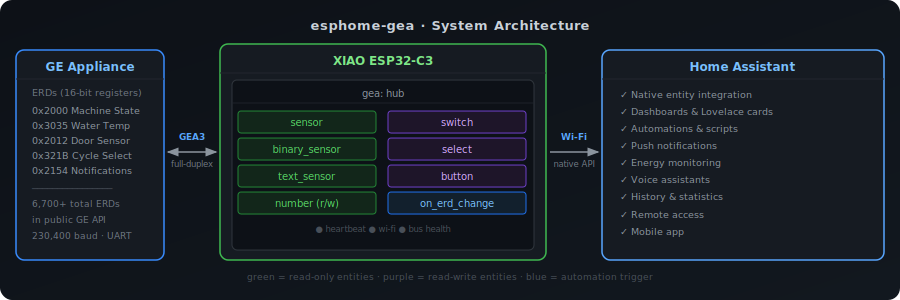
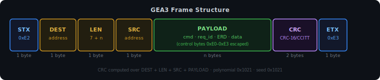
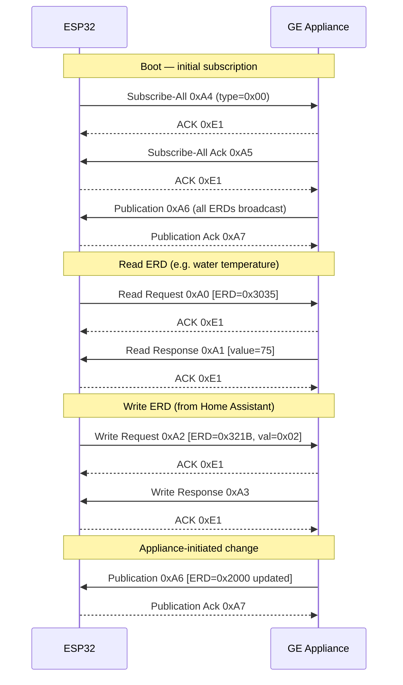
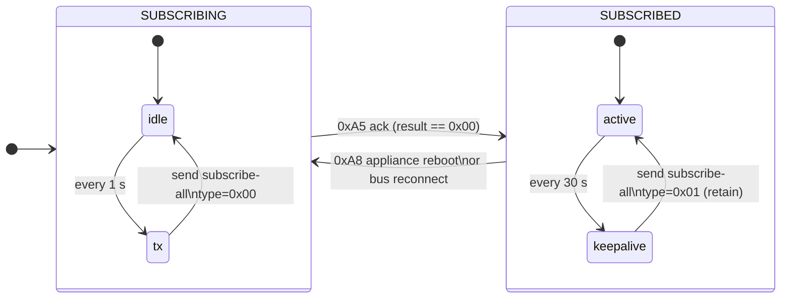

# esphome-gea

[](https://github.com/mguaylam/esphome-gea/actions/workflows/compile.yml)
[](https://esphome.io/components/external_components)
[](LICENSE)
[](https://www.home-assistant.io/)
[](https://www.espressif.com/)

An [ESPHome](https://esphome.io/) external component for monitoring and controlling GE appliances via the **GEA3 serial bus**, with native [Home Assistant](https://www.home-assistant.io/) integration.



---

## Table of Contents

- [Features](#features)
- [Hardware](#hardware)
- [Installation](#installation)
- [Configuration](#configuration)
  - [Hub](#hub)
  - [Sensor](#sensor-read-only)
  - [Binary Sensor](#binary-sensor-read-only)
  - [Switch](#switch-read-write)
  - [Select](#select-read-write)
  - [Text Sensor](#text-sensor-read-only)
  - [Button](#button-write-only)
  - [Number](#number-read-write)
  - [Automation triggers](#automation-triggers)
- [ERD Discovery](#erd-discovery)
- [Diagnostics](#diagnostics)
- [Testing](#testing)
- [Devices](#devices)
- [License](#license)

---

## Features

GE appliances expose their state through **ERDs** (Entity Reference Designators) — 16-bit registers for data like temperatures, cycle states, and settings. This component maps those registers to Home Assistant entities.

- **Full bidirectional control** — read sensor values, toggle switches, change cycle settings, trigger remote start/stop
- **Auto-discovery** — subscribes to all ERDs on boot; unknown registers are logged for reverse-engineering
- **Plug-and-play addressing** — automatically detects appliance bus address from first valid packet
- **Resilient** — periodic re-subscription recovers state after appliance power cycles
- **Flexible decoding** — 13 numeric types (`uint8`, `uint16_be`, `int32_le`, …), raw hex, ASCII strings, enum option maps, plus optional `multiplier`/`offset` for scaled values
- **Multiple entity platforms** — sensor, binary sensor, switch, select, text sensor, button, number
- **Edge-triggered automations** — `on_erd_change` fires on rising/falling/any bitmask transitions
- **Bus health indicator** — `is_bus_connected()` lambda for status LEDs
- **Diagnostic counters** — `get_rx_bytes()`, `get_crc_errors()`, `get_tx_retries()`, `get_dropped_requests()` exposable as template sensors
- **Optional ERD lookup table** — embed the full GE ERD definition set for richer diagnostic logs (+75 KB flash)
- **Native HA integration** — device classes, state classes, diagnostic categories all supported

---

## Hardware

### Bill of Materials

| Part | Notes |
|------|-------|
| [Seeed XIAO ESP32-C3](https://wiki.seeedstudio.com/XIAO_ESP32C3_Getting_Started/) | Compact, 3.3 V, native USB |
| FirstBuild GEA adapter | 8P8C breakout, LEDs, and supporting components all included |

### Wiring

| XIAO ESP32-C3    |   | GE Appliance      |
|------------------|---|-------------------|
| D6 (TX / GPIO21) | → | GEA3 RX           |
| D7 (RX / GPIO20) | ← | GEA3 TX           |
| GND              | ↔ | GND               |
| 3V3              | → | 3.3V (optional)   |

The FirstBuild adapter also connects three status LEDs:

| Pin | Function |
|-----|----------|
| D0 | Heartbeat |
| D1 | Wi-Fi status |
| D2 | Bus status |

> The GEA3 connector on GE appliances is typically accessible behind the appliance's service panel via an 8P8C jack. The FirstBuild breakout board makes this simple to tap into.

### UART Settings

| Parameter | Value |
|-----------|-------|
| Baud rate | **230,400** |
| Data bits | 8 |
| Stop bits | 1 |
| Parity | None |

> **Note:** 19,200 baud is GEA2 (older protocol) and is not supported by this component.

---

## Installation

Add the external component to your ESPHome configuration:

```yaml
external_components:
  - source: github://mguaylam/esphome-gea
    components: [gea]
```

Configure the UART bus on the appropriate pins for your board:

```yaml
uart:
  id: uart_gea
  tx_pin: GPIO21   # D6 on XIAO ESP32-C3
  rx_pin: GPIO20   # D7 on XIAO ESP32-C3
  baud_rate: 230400
```

---

## Configuration

### Hub

The `gea:` block defines the communication hub. All entity platforms reference it via `gea_id`.

```yaml
gea:
  id: gea_hub
  uart_id: uart_gea
  src_address: 0xE4        # Our bus address (default: 0xBB)
  # dest_address: 0xC0     # Optional; auto-detected if omitted
```

| Option | Default | Description |
|--------|---------|-------------|
| `uart_id` | required | ID of the `uart:` block |
| `src_address` | `0xBB` | Source address on the GEA bus |
| `dest_address` | auto | Appliance address; detected from first packet if not set |
| `erd_lookup` | `false` | If `true`, embed the public GE ERD definition set (~75 KB flash) so discovery logs include each ERD's documented name, type, and decoded value |

---

### Sensor (read-only)

Publishes an ERD value as a floating-point number.

```yaml
sensor:
  - platform: gea
    gea_id: gea_hub
    name: "Elapsed Time"
    erd: 0x0702
    decode: uint32_be
    byte_offset: 0
    unit_of_measurement: s
    state_class: total_increasing

  # Scaled value: many GE ERDs encode temperature × 10
  - platform: gea
    gea_id: gea_hub
    name: "Water Temperature"
    erd: 0x3035
    decode: uint16_be
    multiplier: 0.1
    offset: 0
    unit_of_measurement: "°C"
    accuracy_decimals: 1
```

**`decode` types:** `uint8`, `uint16_be`, `uint16_le`, `uint32_be`, `uint32_le`, `int8`, `int16_be`, `int16_le`, `int32_be`, `int32_le`, `bool`

| Option | Default | Description |
|--------|---------|-------------|
| `multiplier` | `1.0` | Multiplied with the decoded raw value |
| `offset` | `0.0` | Added after multiplication: `published = raw × multiplier + offset` |

---

### Binary Sensor (read-only)

Publishes a single bit or byte as a boolean.

```yaml
binary_sensor:
  - platform: gea
    gea_id: gea_hub
    name: "Door"
    erd: 0x2012
    bitmask: 0x01
    device_class: door
```

| Option | Description |
|--------|-------------|
| `bitmask` | Bit mask applied after `byte_offset` extraction |
| `inverted` | Invert the boolean result |

---

### Switch (read-write)

Reads a boolean ERD and writes it back on toggle.

```yaml
switch:
  - platform: gea
    gea_id: gea_hub
    name: "Extra Dry"
    erd: 0x3230
    byte_offset: 2
    payload_on: 0x01
    payload_off: 0x00
```

| Option | Default | Description |
|--------|---------|-------------|
| `byte_offset` | `0` | Byte index inside the ERD payload to compare against `payload_on`/`payload_off` |
| `payload_on` | `0x01` | Byte value indicating the switch is on |
| `payload_off` | `0x00` | Byte value indicating the switch is off |
| `write_erd` | (same as `erd`) | Use a different ERD for writes when read and write addresses differ |

---

### Select (read-write)

Maps numeric ERD values to human-readable labels.

```yaml
select:
  - platform: gea
    gea_id: gea_hub
    name: "Wash Cycle"
    erd: 0x321B
    decode: uint8
    options:
      0x00: "AutoSense"
      0x01: "Heavy"
      0x02: "Normal"
      0x03: "1 Hour Wash"
      0x04: "Rinse Only"
```

---

### Text Sensor (read-only)

Decodes an ERD as a string. Supports three modes:

```yaml
text_sensor:
  # ASCII string (null-terminated)
  - platform: gea
    gea_id: gea_hub
    name: "Cycle Name"
    erd: 0x301C
    decode: ascii

  # Raw hex bytes
  - platform: gea
    gea_id: gea_hub
    name: "Raw State"
    erd: 0x3001
    decode: raw

  # Numeric value mapped to labels
  - platform: gea
    gea_id: gea_hub
    name: "Machine State"
    erd: 0x2000
    decode: uint8
    options:
      0x00: "Idle"
      0x01: "Running"
      0x02: "Paused"
```

---

### Button (write-only)

Sends a fixed payload when pressed. No state feedback.

```yaml
button:
  - platform: gea
    gea_id: gea_hub
    name: "Remote Start"
    erd: 0x2149
    payload: [0x01]
```

---

### Number (read-write)

Bidirectional numeric ERD control with min/max/step validation.

```yaml
number:
  - platform: gea
    gea_id: gea_hub
    name: "Cycle Parameter"
    erd: 0xD004
    decode: uint16_be
    min_value: 0
    max_value: 65535
    step: 1
    entity_category: diagnostic
```

`multiplier` and `offset` are also accepted on numbers; the inverse transform is applied on write so the user-visible scaled value is converted back to the raw bytes the appliance expects.

---

### Automation triggers

#### `on_erd_change`

Fires when a specific bit or byte within an ERD's publication transitions across a configured edge. Defined on the `gea:` hub, not on a platform. Typical use case: appliance event flags (e.g. "wash complete", "detergent low") that the firmware pulses once and expects a consumer to act on.

```yaml
gea:
  id: gea_hub
  uart_id: uart_gea
  on_erd_change:
    - erd: 0x2154
      byte_offset: 1
      bitmask: 0x20
      edge: rising
      then:
        - homeassistant.event:
            event: esphome.washer_notification
            data:
              kind: wash_complete
```

| Option | Default | Description |
|--------|---------|-------------|
| `erd` | required | ERD address to watch |
| `byte_offset` | `0` | Byte index within the ERD payload |
| `bitmask` | `0xFF` | Mask applied to the selected byte |
| `edge` | `rising` | `rising`, `falling`, or `any` |

**Semantics** (where `old` / `new` are the masked values):

| Edge | Fires when |
|------|------------|
| `rising` | `old == 0 && new != 0` |
| `falling` | `old != 0 && new == 0` |
| `any` | `old != new` |

> The first publication of an ERD after boot is a silent baseline — no trigger fires. This prevents spurious events when the ESP reboots mid-cycle.
>
> With a multi-bit mask the masked region is treated as a single aggregated flag ("at least one bit set"). For per-bit detection, define one trigger per bit.

---

<details>
<summary><strong>Protocol Overview</strong></summary>

GEA3 is a full-duplex serial protocol. Each frame has the following structure:



- **STX/ETX:** Frame delimiters (`0xE2` / `0xE3`)
- **LEN:** Total logical length = `7 + len(payload)`
- **CRC:** CRC-16/CCITT, polynomial `0x1021`, seed `0x1021`, computed over `DEST + LEN + SRC + PAYLOAD`
- **Escaping:** Control bytes `0xE0–0xE3` inside the payload are prefixed with `0xE0`

### Command Reference

| Command | Code | Direction | Purpose |
|---------|------|-----------|---------|
| Read Request | `0xA0` | → Appliance | Query ERD value |
| Read Response | `0xA1` | ← Appliance | Returns ERD data |
| Write Request | `0xA2` | → Appliance | Set ERD value |
| Write Response | `0xA3` | ← Appliance | Confirms write success |
| Subscribe-All | `0xA4` | → Appliance | Trigger full ERD publication |
| Subscribe-All Ack | `0xA5` | ← Appliance | Confirms subscription |
| Publication | `0xA6` | ← Appliance | Broadcasts ERD changes |
| Publication Ack | `0xA7` | → Appliance | Acknowledges publication |
| Subscription Host Startup | `0xA8` | ← Appliance | Announces appliance just came online |
| ACK | `0xE1` | ↔ Both | Single-byte acknowledgement |

### Typical Exchange



</details>

---

<details>
<summary><strong>Connection lifecycle</strong></summary>

The component uses a two-state subscription machine:



| State | Behaviour |
| ----- | --------- |
| **SUBSCRIBING** | Sends subscribe-all `type=0x00` every **1 s** until the appliance acknowledges |
| **SUBSCRIBED** | Sends subscribe-all `type=0x01` (retain) every **30 s** as a keep-alive |

The keep-alive is required because the appliance silently drops subscriptions after a few minutes even when the bus remains physically connected.

Transition back to SUBSCRIBING happens on two triggers:

- **Primary:** a `0xA8` "subscription host startup" packet received from the appliance — fires immediately when the appliance broadcasts its boot announcement.
- **Fallback:** a bus silent → active transition, detected when `is_bus_connected()` goes from `false` to `true`. Covers cases where the startup packet is missed.

</details>

---

<details>
<summary><strong>Request reliability</strong></summary>

Every outgoing request (read, write, subscribe-all) goes through a single-in-flight queue with deterministic retry:

| Parameter | Value |
|-----------|-------|
| Timeout per attempt | **250 ms** |
| Max retries | **10** |
| Total worst-case | **~2.75 s** before a request is dropped |

- **Serialization** — only one request is on the wire at a time, so `request_id` matches between request and response without ambiguity.
- **Retry on timeout** — if no matching response arrives within 250 ms, the same `request_id` is resent. A late response from a prior attempt still matches.
- **Request-ID matching** — incoming responses whose `request_id` does not match the pending request are ignored; the pending request stays armed until it either matches a response or exhausts its retries.
- **Unsolicited frames bypass the queue** — ACKs, publications, publication ACKs, and subscription host startup packets are not request/response pairs and are processed independently.

Writes initiated from Home Assistant are non-blocking: the entity returns immediately and the queue transmits in the background. A dropped write (10 retries exhausted) is logged at `WARN` level.

</details>

---

## Diagnostics

The hub exposes per-bus counters callable from YAML lambdas. Pair them with `platform: template` sensors and `entity_category: diagnostic` to surface bus health in Home Assistant:

```yaml
sensor:
  - platform: template
    name: "GEA RX Bytes"
    entity_category: diagnostic
    accuracy_decimals: 0
    lambda: 'return id(gea_hub).get_rx_bytes();'
    update_interval: 30s

  - platform: template
    name: "GEA CRC Errors"
    entity_category: diagnostic
    accuracy_decimals: 0
    lambda: 'return id(gea_hub).get_crc_errors();'
    update_interval: 30s

  - platform: template
    name: "GEA TX Retries"
    entity_category: diagnostic
    accuracy_decimals: 0
    lambda: 'return id(gea_hub).get_tx_retries();'
    update_interval: 30s

  - platform: template
    name: "GEA Dropped Requests"
    entity_category: diagnostic
    accuracy_decimals: 0
    lambda: 'return id(gea_hub).get_dropped_requests();'
    update_interval: 30s
```

| Accessor | Increments on |
|----------|---------------|
| `get_rx_bytes()` | every byte received on the UART |
| `get_crc_errors()` | a framed packet whose CRC does not match |
| `get_tx_retries()` | a pending request times out and is resent |
| `get_dropped_requests()` | a pending request exhausts all retries |

A non-zero **CRC errors** counter on a stable bus usually points to a wiring/grounding issue. A growing **dropped requests** counter while the appliance is awake is more concerning and warrants protocol-level inspection.

---

## Testing

Following the ESPHome convention, tests are **compile-time integration tests**: a single YAML at [`tests/test.yaml`](tests/test.yaml) instantiates every platform, decode type, and option (multiplier/offset, on_erd_change with each edge, distinct read/write ERDs, diagnostic counters via lambda, etc.). If the schema, codegen, or generated C++ regress, the build breaks.

Run locally with:

```bash
esphome compile tests/test.yaml
```

CI runs the same compile job plus the two real device YAMLs ([dishwasher](devices/dishwasher/PDP715SYV0FS.yaml), [washer](devices/washer/PFQ97HSPVDS.yaml)) on every PR.

---

## ERD Discovery

**ERD** (Entity Reference Designator) is a 16-bit identifier for a data register on the appliance — like a temperature reading, machine state, or cycle selection.

On boot the component sends a subscribe-all command. The appliance responds by publishing all supported ERDs. Any ERD not matched to a configured entity is logged at `INFO` level:

```text
[I][gea:042]: Discovered ERD 0x2007: 00 00
[I][gea:042]: Discovered ERD 0x200A: 00 00 00 00
```

You can add these to your configuration as raw `text_sensor` entities to start reverse-engineering their meaning.

---

## Devices

Complete configurations for supported appliances:

| File | Appliance | Highlights |
|------|-----------|------------|
| [`PDP715SYV0FS.yaml`](devices/dishwasher/PDP715SYV0FS.yaml) | GE PDP715SYV0FS | Cycle selection, elapsed time, ASCII cycle name, model retrieval button |
| [`PFQ97HSPVDS.yaml`](devices/washer/PFQ97HSPVDS.yaml) | GE PFQ97HSPVDS (Ultrafast Combo) | Time remaining, door/lock/pump sensors, 200+ cycle options, remote start/stop, detergent/softener dosing |

---

## License

MIT License

Copyright (c) 2024 mguaylam

Permission is hereby granted, free of charge, to any person obtaining a copy
of this software and associated documentation files (the "Software"), to deal
in the Software without restriction, including without limitation the rights
to use, copy, modify, merge, publish, distribute, sublicense, and/or sell
copies of the Software, and to permit persons to whom the Software is
furnished to do so, subject to the following conditions:

The above copyright notice and this permission notice shall be included in all
copies or substantial portions of the Software.

THE SOFTWARE IS PROVIDED "AS IS", WITHOUT WARRANTY OF ANY KIND, EXPRESS OR
IMPLIED, INCLUDING BUT NOT LIMITED TO THE WARRANTIES OF MERCHANTABILITY,
FITNESS FOR A PARTICULAR PURPOSE AND NONINFRINGEMENT. IN NO EVENT SHALL THE
AUTHORS OR COPYRIGHT HOLDERS BE LIABLE FOR ANY CLAIM, DAMAGES OR OTHER
LIABILITY, WHETHER IN AN ACTION OF CONTRACT, TORT OR OTHERWISE, ARISING FROM,
OUT OF OR IN CONNECTION WITH THE SOFTWARE OR THE USE OR OTHER DEALINGS IN THE
SOFTWARE.
