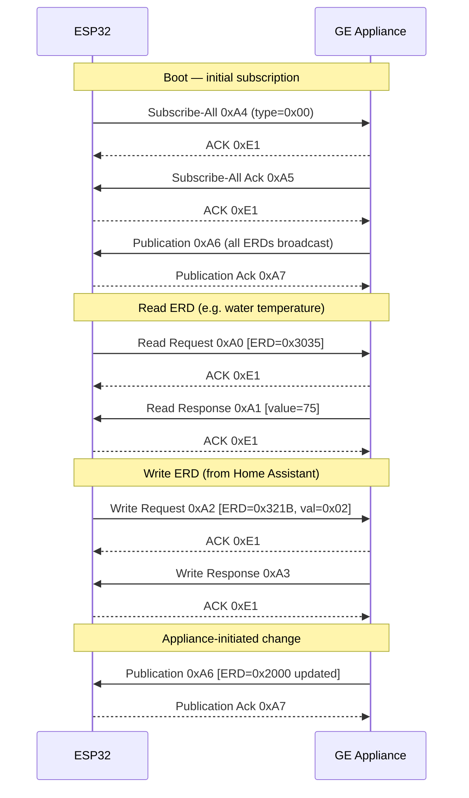
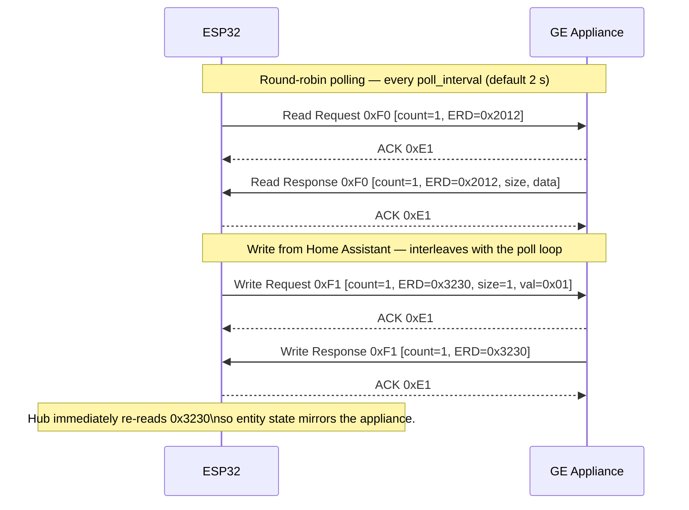
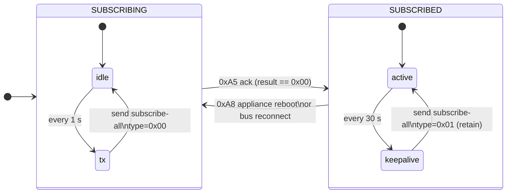

# Protocol & Internals

This page documents how the component talks to the appliance. You don't need
any of this to use the component — but it's useful when reverse-engineering a
new appliance or debugging unusual behaviour on the bus.

The component supports both **GEA3** (newer appliances, full-duplex,
230400 baud) and **GEA2** (older appliances, half-duplex, 19200 baud). The
two protocols share the same wire framing — only the command codes and the
ERD payload format differ.

## Frame format

Each frame on the wire looks like:

- **STX / ETX:** Frame delimiters (`0xE2` / `0xE3`).
- **LEN:** Total logical length = `7 + len(payload)`.
- **CRC:** CRC-16/CCITT, polynomial `0x1021`, seed `0x1021`, computed over
  `DEST + LEN + SRC + PAYLOAD`, MSB-first on the wire.
- **Escaping:** any of `0xE0`–`0xE3` inside the inner bytes is prefixed with
  `0xE0` (the *escape* byte). The receiver state machine strips the escape on
  decode.

The framing is **identical** between GEA2 and GEA3 — same delimiters, same
escape rule, same CRC seed and polynomial. What changes is what goes inside
the payload.

## Command codes

### GEA3 (`0xA0`–`0xA8`)

| Command | Code | Direction | Purpose |
|---------|------|-----------|---------|
| Read Request | `0xA0` | → Appliance | Query ERD value |
| Read Response | `0xA1` | ← Appliance | Returns ERD data |
| Write Request | `0xA2` | → Appliance | Set ERD value |
| Write Response | `0xA3` | ← Appliance | Confirms write success |
| Subscribe-All | `0xA4` | → Appliance | Trigger full ERD publication |
| Subscribe-All Ack | `0xA5` | ← Appliance | Confirms subscription |
| Publication | `0xA6` | ← Appliance | Broadcasts ERD changes |
| Publication Ack | `0xA7` | → Appliance | Acknowledges publication |
| Subscription Host Startup | `0xA8` | ← Appliance | Appliance just came online |
| ACK | `0xE1` | ↔ Both | Single-byte acknowledgement |

GEA3 payloads carry an explicit `request_id` byte that the appliance echoes
back on the matching response.

### GEA2 (`0xF0` / `0xF1`)

| Command | Code | Direction | Purpose |
|---------|------|-----------|---------|
| Read Request / Response | `0xF0` | ↔ Both | Same code in both directions; direction is implied by `dest`. |
| Write Request / Response | `0xF1` | ↔ Both | Same as above. |
| ACK | `0xE1` | ↔ Both | Single-byte acknowledgement |

GEA2 has **no subscriptions, no publications, and no `request_id`**. There
is no equivalent of the GEA3 `0xA4`–`0xA8` family. The hub matches a
response to the pending request by ERD address — which works because only
one request is on the wire at a time.

### ERD payload layout

This is where GEA2 and GEA3 actually diverge:

| | GEA3 read | GEA2 read |
|---|---|---|
| Body | `[req_id][erd_h][erd_l]` | `[count=1][erd_h][erd_l]` |

| | GEA3 write | GEA2 write |
|---|---|---|
| Body | `[req_id][erd_h][erd_l][size][data…]` | `[count=1][erd_h][erd_l][size][data…]` |

GEA2 prefixes the body with a single-byte ERD count (always `1` here) and
omits the request ID. GEA3 includes the request ID and no count.

## Typical exchange (GEA3)

## Typical exchange (GEA2)

GEA2 has no subscriptions, so the hub polls each declared ERD in turn. Since
the bus is half-duplex the hub also sees its own transmission echoed back —
that echo is consumed byte-by-byte as collision detection (see
[Collision handling](#collision-handling-gea2)), with a source-address check
as fallback for anything that slips through.

## Connection lifecycle (GEA3)

The component uses a two-state subscription machine:

| State | Behaviour |
|-------|-----------|
| **SUBSCRIBING** | Sends subscribe-all `type=0x00` every **1 s** until the appliance acknowledges. |
| **SUBSCRIBED** | Sends subscribe-all `type=0x01` (retain) every **30 s** as a keep-alive. |

The keep-alive is required because the appliance silently drops subscriptions
after a few minutes even when the bus stays physically connected.

Transition back to **SUBSCRIBING** happens on either:

- **Primary:** a `0xA8` "subscription host startup" packet from the appliance
  (fires immediately when the appliance broadcasts its boot announcement).
- **Fallback:** a bus silent → active transition, detected when
  `is_bus_connected()` flips from `false` to `true`. Covers cases where the
  startup packet is missed.

## Connection lifecycle (GEA2)

There is no subscription state machine on GEA2. Instead, the hub:

1. Builds a deduplicated list of every ERD referenced by an entity or by an
   `on_erd_change` automation.
2. Round-robin polls one ERD per `poll_interval`, single-in-flight, sharing
   the same retry queue as user-initiated writes.
3. Skips a tick when the queue is busy — so a write doesn't get stuck behind
   the poll cycle.
4. After a successful write, immediately re-reads the same ERD so the
   matching entity reflects the appliance's new state without waiting for
   the next poll.

Bus health is still derived from `last_rx_ms_`, so `is_bus_connected()` works
identically on both protocols.

## Bus topology & hardware

GEA2 and GEA3 share the same logical framing but use very different
electrical layers — and on a multi-node bus, that has consequences.

### GEA3 — full-duplex, point-to-point

GEA3 separates TX and RX physically. Two simple tri-state buffers on the
carrier board (one per direction) bridge the appliance bus to the MCU UART.
There's no echo, no collision risk, no shared medium. From the firmware's
point of view it's just a fast UART link.

### GEA2 — half-duplex, multi-node, wired-OR

GEA2 is a **shared open-drain bus** that several appliance modules
(main board, control panel, ice maker, dispenser, …) drive simultaneously
in a wired-OR fashion. On a typical FirstBuild / GE Home Assistant Adapter
board:

- A high-side PNP transistor drives the bus dominant when the MCU TX is
  asserted; release lets the bus float to the recessive state.
- A NAND-gate inverter on the receive path feeds the **bus** signal (not
  the MCU TX line) back into the MCU RX. As a side-effect, **everything
  the MCU transmits is echoed back on RX** — this is intentional and is
  what enables byte-level collision detection in GE's reference firmware.
- No UART inversion is required: idle bus → MCU RX HIGH → standard 8N1.

Schematic of the official board:
[geappliances/home-assistant-adapter/doc/schematic-v1.0.pdf](https://github.com/geappliances/home-assistant-adapter/blob/main/doc/schematic-v1.0.pdf).

## Collision handling (GEA2)

Because GEA2 is a multi-node bus, two nodes can start transmitting at the
same time and corrupt each other's frames. GE's reference firmware
(`tiny-gea-api`) uses **byte-level echo verification**: each transmitted
byte is compared against what comes back on RX, and a mismatch triggers an
immediate abort + pseudo-random backoff (≈43–106 ms, derived from the
node's address).

**What this component does:**

- **Collision avoidance** — a request (initial send, retry, or
  address-discovery probe) only goes on the wire when the bus is clear: no
  frame mid-reception, no echo of our own transmission still outstanding,
  and ≥10 ms of line silence (~19 byte-times at 19200 baud). Immediate ACK
  responses are exempt — the peer expects them right after its frame.
- **Collision detection** — the exact wire image of every transmission is
  kept and compared byte-for-byte against the bus echo as it returns. A
  mismatch means another node drove the line at the same time; the pending
  request is resent after a short random backoff (2–19 ms) instead of
  waiting out the full 250 ms timeout. Detected collisions are counted
  (`get_tx_collisions()` — see [Diagnostics](diagnostics.md)) and included
  in the periodic RX stats log line.
- **Millisecond responsiveness** — while an exchange is in flight the
  component holds ESPHome's high-frequency loop request, so the idle gate,
  echo matcher and backoff retry run at millisecond resolution instead of
  the ~16 ms default loop interval. The request is released as soon as the
  bus goes quiet, so idle polling costs nothing.
- **Wiring diagnostics** — an echo that never returns is flagged with a
  WARNING after 100 ms (TX not reaching the bus, or RX not hearing it)
  instead of looking like an ordinary response timeout.

**What it still doesn't do, and why:**

- **No mid-frame abort.** The frame is committed to the UART FIFO as a
  whole, so by the time an echo mismatch is observed the frame is already
  on the wire. The reference firmware transmits byte-by-byte and aborts on
  the first divergent byte, but doing that here would mean busy-waiting
  between bytes (blocking ESPHome's cooperative loop for the frame
  duration) or a custom ISR behind the `uart` component's back. Recovery is
  a fast retry of the whole frame instead — at 19200 baud a frame is
  5–20 ms, so the difference is small.
- **A small race window remains.** The bus-clear check runs in `loop()`, so
  another node can still start transmitting between the check and the
  write. The high-frequency loop shrinks that window to roughly millisecond
  scale but cannot close it; a collision in the window is caught by echo
  verification and retried.

The other nodes on the bus run `tiny-gea-api` (or equivalent) and detect
collisions on their side too, so after a collision both parties back off
and converge. See
[Discussion #3](https://github.com/mguaylam/esphome-gea/discussions/3) for
field reports, including what the `TX collisions` counter does on real
buses.

## Request reliability

Every outgoing request (read, write, subscribe-all) goes through a
single-in-flight queue with deterministic retry:

| Parameter | Value |
|-----------|-------|
| Timeout per attempt | **250 ms** |
| Max retries | **10** |
| Total worst-case | **~2.75 s** before a request is dropped |

- **Serialization** — only one request is on the wire at a time, so on GEA3
  the `request_id` matches between request and response without ambiguity,
  and on GEA2 the ERD address alone is enough to identify the pending
  exchange.
- **Retry on timeout** — if no matching response arrives within 250 ms, the
  same request is resent. A late response from a prior attempt still
  matches.
- **Response matching** —
  - **GEA3**: incoming responses whose `request_id` doesn't match the
    pending request are ignored.
  - **GEA2**: incoming responses whose ERD doesn't match the pending request
    are ignored. Self-echoes on the half-duplex bus are consumed earlier by
    the echo matcher (or dropped by the source-address fallback), so they
    never reach this stage.
- **Unsolicited frames bypass the queue** — ACKs, publications, publication
  ACKs, and subscription host startup packets are not request/response pairs
  and are processed independently. (GEA2 has none of these.)

Writes initiated from Home Assistant are **non-blocking**: the entity returns
immediately and the queue transmits in the background. A dropped write
(10 retries exhausted) is logged at `WARN` level and increments
`get_dropped_requests()` — see [Diagnostics](diagnostics.md).

## References

This component's protocol implementation was informed by GE Appliances'
publicly released reference projects (all BSD-3-Clause). No code is copied
— our C++ implementation is independent — but their work documents the
wire-level behaviour, timing constants, and design intent of the bus.

- **[geappliances/tiny-gea-api](https://github.com/geappliances/tiny-gea-api)**
  — minimal C library implementing both GEA2 and GEA3 framing, CRC, and
  the GEA2 byte-level collision-detection FSM. The canonical source of
  truth for "what should a node on this bus actually do".
- **[geappliances/home-assistant-adapter](https://github.com/geappliances/home-assistant-adapter)**
  — the official GE-published carrier board (schematic, firmware, BOM).
  Useful for understanding the GEA2 electrical layer (echo path, PNP
  driver, no UART inversion required).
- **[geappliances/arduino-gea2](https://github.com/geappliances/arduino-gea2)**
  — Arduino wrapper around `tiny-gea-api` for GEA2; doubles as a working
  example of the polling and timing constants in a real sketch.

## See also

- [Diagnostics](diagnostics.md)
- [Troubleshooting](troubleshooting.md)
