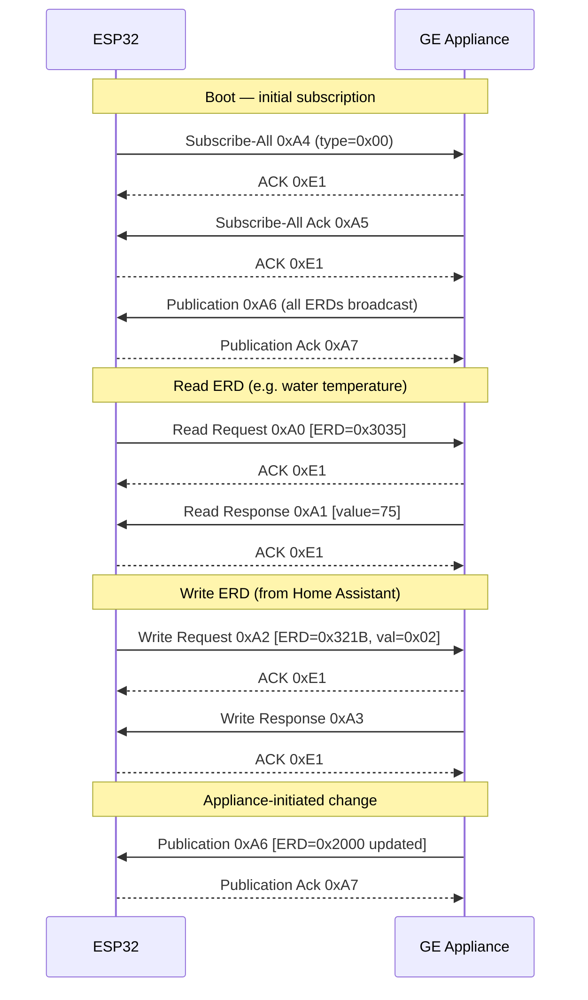
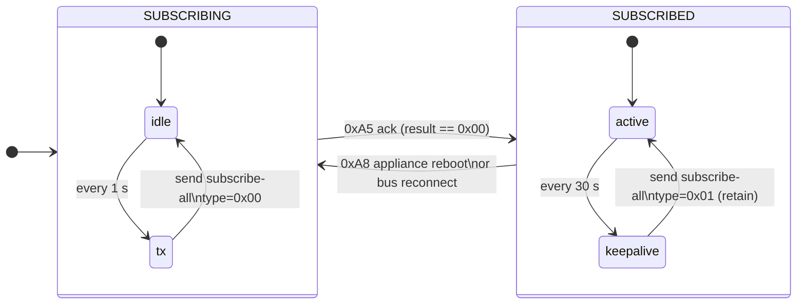

# Protocol & Internals

This page documents how the component talks to the appliance. You don't need
any of this to use the component — but it's useful when reverse-engineering a
new appliance or debugging unusual behaviour on the bus.

## Frame format

GEA3 is a full-duplex serial protocol. Each frame on the wire looks like:

- **STX / ETX:** Frame delimiters (`0xE2` / `0xE3`).
- **LEN:** Total logical length = `7 + len(payload)`.
- **CRC:** CRC-16/CCITT, polynomial `0x1021`, seed `0x1021`, computed over
  `DEST + LEN + SRC + PAYLOAD`, MSB-first on the wire.
- **Escaping:** any of `0xE0`–`0xE3` inside the inner bytes is prefixed with
  `0xE0` (the *escape* byte). The receiver state machine strips the escape on
  decode.

## Command codes

| Command | Code | Direction | Purpose |
|---------|------|-----------|---------|
| Read Request | `0xA0` | → Appliance | Query ERD value |
| Read Response | `0xA1` | ← Appliance | Returns ERD data |
| Write Request | `0xA2` | → Appliance | Set ERD value |
| Write Response | `0xA3` | ← Appliance | Confirms write success |
| Subscribe-All | `0xA4` | → Appliance | Trigger full ERD publication |
| Subscribe-All Ack | `0xA5` | ← Appliance | Confirms subscription |
| Publication | `0xA6` | ← Appliance | Broadcasts ERD changes |
| Publication Ack | `0xA7` | → Appliance | Acknowledges publication |
| Subscription Host Startup | `0xA8` | ← Appliance | Appliance just came online |
| ACK | `0xE1` | ↔ Both | Single-byte acknowledgement |

## Typical exchange

## Connection lifecycle

The component uses a two-state subscription machine:

| State | Behaviour |
|-------|-----------|
| **SUBSCRIBING** | Sends subscribe-all `type=0x00` every **1 s** until the appliance acknowledges. |
| **SUBSCRIBED** | Sends subscribe-all `type=0x01` (retain) every **30 s** as a keep-alive. |

The keep-alive is required because the appliance silently drops subscriptions
after a few minutes even when the bus stays physically connected.

Transition back to **SUBSCRIBING** happens on either:

- **Primary:** a `0xA8` "subscription host startup" packet from the appliance
  (fires immediately when the appliance broadcasts its boot announcement).
- **Fallback:** a bus silent → active transition, detected when
  `is_bus_connected()` flips from `false` to `true`. Covers cases where the
  startup packet is missed.

## Request reliability

Every outgoing request (read, write, subscribe-all) goes through a
single-in-flight queue with deterministic retry:

| Parameter | Value |
|-----------|-------|
| Timeout per attempt | **250 ms** |
| Max retries | **10** |
| Total worst-case | **~2.75 s** before a request is dropped |

- **Serialization** — only one request is on the wire at a time, so
  `request_id` matches between request and response without ambiguity.
- **Retry on timeout** — if no matching response arrives within 250 ms, the
  same `request_id` is resent. A late response from a prior attempt still
  matches.
- **Request-ID matching** — incoming responses whose `request_id` doesn't
  match the pending request are ignored; the pending request stays armed
  until it either matches a response or exhausts its retries.
- **Unsolicited frames bypass the queue** — ACKs, publications, publication
  ACKs, and subscription host startup packets are not request/response pairs
  and are processed independently.

Writes initiated from Home Assistant are **non-blocking**: the entity returns
immediately and the queue transmits in the background. A dropped write
(10 retries exhausted) is logged at `WARN` level and increments
`get_dropped_requests()` — see [Diagnostics](diagnostics.md).

## See also

- [Diagnostics](diagnostics.md)
- [Troubleshooting](troubleshooting.md)
